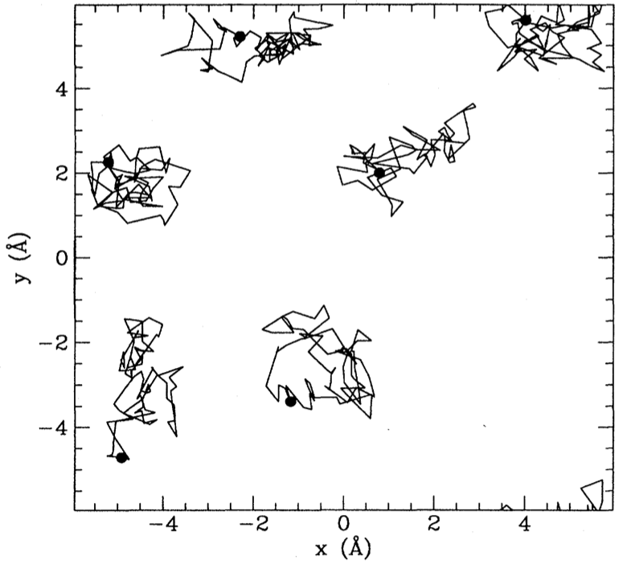

In Lecture 1 we introduced the idea of Variational Inference (VI), which turns the problem of inference in latent variable models into one of optimization. That was a rather high-level view: in this lecture we are going to see in more detail how this works in practice in modern approaches that leverage neural networks and automatic differentiation. Specifically, we going to look at one class of versatile models, with many generalizations, called **Variational Autoencoders**.

$$
\newcommand{\E}{\operatorname{\mathbb{E}}}
\newcommand{\cE}{\mathcal{E}}
\renewcommand{\R}{\mathbb{R}}
\newcommand{\bx}{\mathbf{x}}
\newcommand{\bz}{\mathbf{z}}
\newcommand{\br}{\mathbf{r}}
\newcommand{\bv}{\mathbf{v}}
\newcommand{\bmu}{\boldsymbol{\mu}}
\newcommand{\bSigma}{\boldsymbol{\Sigma}}
\newcommand{\bzeta}{\boldsymbol{\zeta}}
$$

## Lecture 2: The Variational Autoencoder

### VI redux

Suppose we have a model defined by a prior $p(z)$ over latent variables and a generative model $p\_\phi(x|z)$ for our data $x$ with parameters $\phi$. We introduce a similar model for the posterior distribution of the latent variables $q\_\theta(z|x)$. This establishes two representations of the joint distribution of observed and latent variables. We'll call the model expressed in terms of the generative model and the prior the **forward** model

$$
p_\text{F}(x,z)= p_\theta(x|z)p(z),
$$

and the model expressed in terms of the data distribution $p\_\text{D}(x)$ and the posterior the **backward** model

$$
p_\text{B}(x,z)= q_\phi(z|x)p_\text{D}(x).
$$

The KL between these two models is

$$
D_\text{KL}(p_\text{B}||p_\text{F})= \E_{x\sim \text{Data}}\left[\E_{z\sim q_\phi(\cdot|x)}\left[\log\left(\frac{q_\phi(z|x)p_\text{D}(x)}{p_\theta(x|z)p(z)}\right)\right]\right]\geq 0.
$$

This inequality can be rearranged to

$$
H[p_\text{D}]\leq \E_{x\sim \text{Data}}\left[\E_{z\sim q_\phi(\cdot|x)}\left[\log\left(\frac{q_\phi(z|x)}{p_\theta(x|z)p(z)}\right)\right]\right].
\tag{1}
\label{eq:kl-loss}
$$

It doesn't matter that we don't have the explicit form of the data distribution $p_\text{D}(x)$, because the right hand side only involves the expectation over this distribution (that's why we chose this KL and not the reverse). This is implemented as an empirical average over (batches of) the data.

The right hand side of $\eqref{eq:kl-loss}$ is often presented as

$$
\E_{x\sim \text{Data}}\left[D_\text{KL}(q_\phi(\cdot|x)||p)-\E_{z\sim q_\phi(\cdot|x)}\left[\log p_\theta(x|z)\right]\right].
$$

The first term is small when the posterior matches the prior, while the second is small when the output of the generative model matches the data (the **reconstruction error**). Using \eqref{eq:kl-loss} as a loss function for optimization therefore represents a trade-off between these two contributions. 

There is considerable freedom in this formulation. Given a data distribution, we could change the forward and backward model, keeping $p_\text{F}=p_\text{B}$ but changing the prior $p(z)$. Even after fixing the prior, the joint distribution $p(x,z)$ is not fixed, being determined by an unspecified [Copula](https://en.wikipedia.org/wiki/Copula_(probability_theory)) between the two sets of variables. In practice, the parameterization of the forward and backward models, as well as the details of the optimization, will determine what you get. Additional terms are sometimes added to an objective function, particularly for overparameterized models like deep neural nets, to "encourage" certain behaviour in the parameters. This is called **regularization**.

### Variational autoencoder

[Kingma and Welling](https://arxiv.org/abs/1312.6114) noticed that the above description fits neatly into an exisiting class of ML models called [Autoencoders](https://en.wikipedia.org/wiki/Autoencoder). In their original incarnation these are deterministic models that use neural nets (NNs) to map the original data $x$ to some lower dimensional representation in terms of some latent variables $h$ (this part is called the **encoder**), and then map $h$ to an output $x'$ of the same format as the original data (**decoder**). 

An autoencoder is trained to return outputs close to the inputs. Because of the lower dimensional hidden layer, it cannot do this in a trivial way by learning the identity mapping in the data space. Instead, the idea is that if the data lives close to some lower dimensional manifold embedded in the high dimensional data space – an idea called the **manifold hypothesis** – the trained autoencoder can map this data manifold to the hidden layer. 

To perform VI in the autoencoder framework – giving a [Variational Autoencoder](https://en.wikipedia.org/wiki/Autoencoder#Variational_autoencoder_(VAE)) (VAE) – we need two things

1. A way to parameterize $p_\theta(x|z)$ and $q_\phi(z|x)$ using NNs.
2. A way to take gradients of the loss function
$$
 \mathcal{L}(\theta,\phi)=\E_{x\sim \text{Data}}\left[D_\text{KL}(q_\phi(\cdot|x)||p)-\E_{z\sim q_\phi(\cdot|x)}\left[\log p_\theta(x|z)\right]\right]
 \tag{2}
 \label{eq:VAE-loss}
$$
to perform optimization.

Let's look at these in turn.

#### Parameterization 

Suppose our latent variables are $\bz\in \R^{H}$ ( we switch to bold notation to emphasize that we are dealing with a vector of continuous variables). For the encoder $q_\phi(\bz|\bx)$, it's normal to choose the multivariate normal distribution $\mathcal{N}(\bmu_\phi(\bx),\bSigma_\phi(\bx))$ with mean $\bmu_\phi(\bx)\in \R^{H}$ and symmetric covariance matrix $\bSigma(\bx)\in \R^{H\times H}$ dependent on the input $\bx\in \R^D$. If the prior is also normal – the choice $\mathcal{N}(0,\mathbb{1})$ is common – the KL term in \eqref{eq:VAE-loss} can be evaluated explicitly in terms of $\bmu_\phi(\bx)$ and $\bSigma_\phi(\bx)$.

In practice the covariance matrix $\bSigma_\phi(\bx)$ is usually chosen to be diagonal for simplicity. The functions $\bmu_\phi(\bx)$ and $\bSigma_\phi(\bx)$ are then parameterized using NNs, with an architecture that is adapted to the data. [Convolutional neural networks](https://en.wikipedia.org/wiki/Convolutional_neural_network) are widely used for images, for example.

If we make a similar model for the decoder $p_\theta(\cdot|\bz)=\mathcal{N}(\bmu'_\theta(\bz),\bSigma'_\theta(\bz))$, then the second term of \eqref{eq:VAE-loss} involves

$$
-\log p_\theta(\bx|\bz) = \frac{1}{2}(\bx-\bmu'_\theta(\bz))^T\bSigma'^{-1}_\theta(\bz)(\bx-\bmu'_\theta(\bz))+\frac{1}{2}\log\det\bSigma_\theta'(\bz)+\text{const.},
$$

which encourages the mean output $\bmu'\_\theta(\bz)$ for $\bz\sim q_\phi(\cdot|\bx)$ to be close to the data point $\bx$ (reconstruction error). 

The required expectation over $\bz$ cannot be taken in closed form, however, if we want to model a complex decoder function $p_\theta$. It has to be done by Monte Carlo, but the expectation depends on parameters $\phi$, and we want to take derivatives with respect to these parameters. What do we do?

#### Reparameterization trick

For continuous variables there is a nice solution, which you'd probably think of fairly quickly, though it has its own name: the **reparameterization trick**. 

If you want to generate samples from $\mathcal{N}(\mu,\sigma^2)$ and you have at your disposal a random variable $\zeta\sim\mathcal{N}(0,1)$ then $\sigma \zeta +\mu$ does the job. The nice thing about this observation is that it separates the parameters from the sampling, so that a Monte Carlo estimate of an expectation

$$
\E_{x\sim \mathcal{N}(\mu,\sigma^2)}\left[f(x)\right]\approx \frac{1}{S}\sum_{s=1}^S f(\sigma z_s + \mu)
$$

is explicitly a function of $\sigma$ and $\mu$, so that derivatives with respect to these parameters may be calculated. This generalizes straightforwardly to the multivariate Gaussian we use in the decoder as $\bz\sim \bSigma_\phi^{1/2}(\bx)\bzeta+\mu_\phi(\bx)$. For other distributions the required functional mapping may become more complicated.

It's clear that the reparameterization trick is limited to continuous variables. Monte Carlo gradient estimation for discrete variables is [an active area of research](https://jmlr.csail.mit.edu/papers/v21/19-346.html).

#### More practicalities

At this point we understand how to evaluate the loss function on a data point $\bx$ using Monte Carlo estimation for the encoder $\bz\sim q\_\phi(\cdot|\bx)$, in such a way that the estimate is differentiable. In practice a single $\bz$ sample is usually found to provide useful gradients for optimization. Large datasets are usually split into **batches** (sometimes called **mini-batches**, confusingly), so for a batch of size $B$ the loss function is estimated as

$$
 \mathcal{L}(\theta,\phi)\approx\frac{1}{B}\sum_{b=1}^B\left[D_\text{KL}(q_\phi(\cdot|\bx_b)||p)-\log p_\theta(\bx_b|\bSigma_\phi^{1/2}(\bx_b)\bzeta_b+\mu_\phi(\bx_b))\right]\qquad \bzeta_b\sim \mathcal{N}(0,\mathbb{1})
$$

For optimization, gradients are calculated by automatic differentiation, implemented in all modern deep learning libraries. There's a great deal of craft to this business, but that's enough detail for now.

#### Interpretability

One of the promises of latent variable models like the VAE is that, as well as providing a good generative model for making new samples, or a way of assessing the likelihood of inputs, the latent space may be **interpretable**. That is, moving in a lower dimensional latent space $\R^H$ may allow us to explore the manifold on which the data is embedded in $\R^D$. Developing models and training protocols that encourage this **structure learning** is an area of active research, but here are some of the issues:

1. Nothing about the loss function \eqref{eq:VAE-loss} actually requires that the latent space is used *at all*. If the decoder model $p\_\theta(\bx|\bz)$ is rich enough it's possible that it approaches the data distribution for *any* $\bz$:  $p\_\theta(\bx|\bz)\approx p\_\text{D}(\bx)$, meaning that by Bayes' theorem the posterior is
$$
\frac{p\_\theta(\bx|\bz)p(\bz)}{p\_\text{D}(\bx)}\approx p(\bz),
$$
the same as the prior! This is known as **posterior collapse**. You may have a good generative model, but you don't learn anything about your data.

2. Even if the latent space is used by the trained model, there's no guarantee that it's used *nicely*, with different latent variables corresponding to meaningfully different qualities of the data: colour, shape, position, etc.. This is called **disentangling**. Part of the problem is that the prior $\mathcal{N}(0,\mathbb{1})$ is rotationally invariant, so lifting this symmetry is necessary.

#### Compression with VAEs: bits back

In Lecture 1 we discussed the entropy as a fundamental bound on the compression of data, and I suggested that good probabilistic models tailored to a particular kind of data would give better compression. How can we deliver on this promise for latent variable models like the VAE? The problem, as always, is that the model doesn't supply an explicit expression for $p_\text{M}(x)$: marginalizing over the latent variables is intractable. 

There is a beautiful idea called **bits back coding** that is particularly well suited to the encoder-decoder formulation of latent variable models, and allows the unavailability of $p_\text{M}(x)$ to be circumvented. Recall that the loss function of the VAE is based on the inequality

$$
H[p_\text{D}]\leq \E_{x\sim \text{Data}}\left[\E_{z\sim q_\phi(\cdot|x)}\left[\log\left(\frac{q_\phi(z|x)}{p_\theta(x|z)p(z)}\right)\right]\right].
$$

Let's split the right hand side up into three terms 

$$
\E_{x\sim \text{Data}}\left[\E_{z\sim q_\phi(\cdot|x)}\left[\log\left(q_\phi(z|x)\right)-\log\left(p_\theta(x|z)\right)-\log\left(p(z)\right)\right]\right].
\tag{3}
\label{eq:loss-3-terms}
$$

Recall that $-\log_2 p(x)$ is the length in bits of the optimal encoding of $x$. The last two terms could be interpreted as follows

 1. Given data $x$ we sample $z\sim q_\phi(\cdot|x)$. 
 2. We encode $x$ using the distribution $p_\theta(\cdot|z)$, then
 3. Encode $z$ using the prior $p(\cdot)$. 
 
 When it comes to decoding, we go in reverse: decoding $z$ using the prior and then $x$ using $p\_\theta(\cdot|z)$. We'll never reach the Shannon bound this way, however, because of the negative first term in \eqref{eq:loss-3-terms}. We need to make the code *shorter*. How? At this point we need to remember that the idea of entropy as a lower bound applies in the limit of $N\to\infty$ iid data. Imagine a semi-infinite bit stream that we are mid-way through encoding. Here's the big idea: we decode part of already encoded bitstream using the model $q\_\phi(\cdot|x)$. The result is a $z\sim q\_\phi(\cdot|x)$ which we then use for encoding $x$ as described above. These are the **bits back**: we will remove $H(q\_\phi(\cdot|x))$ bits on average, which allows us to reach the Shannon bound (in reality the separate encoding and decoding stages are not perfect). When decoding data, the last thing we do for each $x$ is encode $z$ back to the bitstream using $q\_\phi(\cdot|x)$

I'm of course skipping over many issues to do with the implementation, including quantizing the data of a continuous VAE, and the fact that the stack-like nature of the encoder had to await the development of [asymmetric numeral systems](https://en.wikipedia.org/wiki/Asymmetric_numeral_systems) to become practical. See the [original paper](https://arxiv.org/abs/1901.04866) for more details.

### Related Models

The VAE framework is quite general, and in recent years has been elaborated in various ways. 

#### Markov Model autoencoders

So our encoder and decoder were just Gaussian models, albeit with a potentially complicated dependence of the mean and covariance. Can we produce a model with a richer distribution? One straightforward way is to make the forward and backward models Markov processes with $T$ steps, with latent variables $z_0,\ldots z_{T-1}$. It's easier to write if we identify $x=z_T$, so that  

$$
p_\text{F}(z_0,\ldots x=z_T) = p_\theta(x=z_T|z_{T-1})p_\theta(z_{T-1}|z_{T-2})\cdots p_\theta(z_1|z_{0})p(z_0)
$$

$$
p_\text{B}(z_0,\ldots \ldots x=z_T) = q_\phi(z_0|z_{1})\cdots q_\phi(z_{T-2}|z_{T-1})q_\phi(z_{T-1}|z_T)p_\text{D}(x=z_T)
$$

(We could have different kernels at each time step, and different dimensionalities, but I'm suppressing this for now). The loss function comes from a straightforward generalization of \eqref{eq:kl-loss}

$$
H[p_\text{D}]\leq \E_{z\sim p_\text{B}}\left[\log \left(\frac{q_\phi(z_0|z_1)}{p(z_0)}\right)+\sum_{t=0}^{T-2}\log\left(\frac{q_\phi(z_{t+1}|z_{t+2})}{p_\theta(z_{t+1}|z_t)}\right)\right].
$$

This loss is an expectation (with respect to the backward model) of the log-likelihood ratio of the forward and backward Markov processes. Note that this model has a large amount of "gauge" freedom: the intermediate dynamics is completely unspecified by the loss function so will be determined by the details of the parameterization and optimization. 

<!-- h transform -->

We can even imagine passing to the *continuous time limit*, in which case $z_t$ becomes a continuous time stochastic process described by a stochastic differential equation (SDE). 

$$
dz_t = \mu_\theta(z_t)dt + dW_t
$$

where $W_t$ denotes a $\R^H$ dimensional Brownian motion. and $\mu\_\theta(z\_t)$ is a parameterized drift (it could have an explicit time dependence too). More precisely, there are *two* SDEs, one describing the forward process and one the backward, each with their own drift (for technical reasons the volatilities of the two processes have to match, which is why they've been set to one here). In the continuum limit the KL involves the log of the [Radon–Nikodym derivative](https://en.wikipedia.org/wiki/Radon%E2%80%93Nikodym_theorem). 

A nice feature of the SDE formulation is that the model is separated from the implementation of the dynamics. You can solve the SDE by whatever method you like: as long as you can differentiate the solution with respect to the parameters it can be plugged into the loss and optimized. 

One possible application of this kind of model is to infer the trajectories that led to some measured outcomes in stochastic dynamics. 
If the forward model is fixed and describes a simulation of a physical system – for example a molecular dynamics simulation of a biomolecule – the backward model can be used to infer the trajectories that led up to some measured states $z_T$.

Alternatively, one can fix the backward model and just learn the forward  model. This seems a bit strange from our original point of view of finding the posterior, but one can obtain perfectly good generative models this way. See [Denoising Diffusion Probabilistic Models](https://arxiv.org/abs/2006.11239) for a recent example.

#### Normalizing flows

Autoencoders were originally conceived to learn a low dimensional latent representation of the data. By taking the latent space and the data space to be identical $\R^H=\R^D$, however, we can make contact with another kind of model called a [Normalizing Flow](http://proceedings.mlr.press/v37/rezende15.html). In this setting, let's take the covariances of the Gaussian models for the encoder ($\bSigma_\phi$) and decoder ($\bSigma'_\theta$) to zero, so that $q_\phi(\bz|\bx)$ and $p_\theta(\bx|\bz)$ become deterministic maps given by 

$$
\bz = \mu_\phi(\bx),\qquad \bx = \mu'_\theta(\bz).
\tag{4}
\label{eq:bij}
$$

The only way for the KL to be nonzero in this limit is if these maps are inverses of each other. What value does the KL take in this case? The multivariate Gaussian distribution for the encoder is

$$
q_\phi(\cdot|\bx) = \frac{1}{\sqrt{(2\pi)^{D} \det\bSigma_\phi(\bx)}} \exp\left[-\frac{1}{2}(\bz-\bmu_\phi(\bx))^T\bSigma^{-1}_\phi(\bx)(\bz-\bmu_\phi(\bx))\right],
$$

with a similar expression for the decoder. The KL involves the ratio

$$
\frac{q_\phi(\bz|\bx)}{p_\theta(\bx|\bz)}
$$

which, when $\bz$ and $\bx$ are related by \eqref{eq:bij}, takes on the value

$$
\frac{q_\phi(\bz|\bx)}{p_\theta(\bx|\bz)}\longrightarrow \sqrt{\frac{\det\bSigma'_\theta(\bz)}{\det\bSigma_\phi(\bx)}}=\det \left(\frac{\partial\bx}{\partial\bz}\right).
$$

The appearance of the Jacobian is more easily understood starting from first principles. If $\bz$ is described by a probability density $p(\bz)$ then $\bx=\mu'_\theta(\bz)$ has density

$$
\det\left(\frac{\partial\bz}{\partial\bx}\right) p(\mu_\phi(\bx)).
$$

In words: to evaluate the probability density at $\bx$ we map to $\bz$ and evaluate the density there, accounting for the Jacobian of the transformation. 

In the deterministic limit, the KL becomes

$$
D_\text{KL}(p_\text{B}||p_\text{F})\longrightarrow -\E_{x\sim \text{Data}}\left[\log\det \left(\frac{\partial\bz}{\partial\bx}\right)+\log p(\mu_\phi(\bx))\right].
$$

Conceptually, normalizing flows are perhaps a bit simpler than VAEs. The challenge in implementing this scheme is constructing flexible, invertible models with tractable Jacobians (since computing the determinant is $O(D^3)$ and has to be done for every data point). In practice this is done by stacking together simpler transformations, each of which is invertible with known Jacobian.

### Learning the path integral

Finally, we'll look at an application of these methods from [Barr, Gispen, Lamacraft (2020)](http://proceedings.mlr.press/v107/barr20a.html) that is squarely in the domain of physics: finding the ground states of quantum systems. 

#### The Feynman–Kac formula

One of the many connections between quantum mechanics and stochastic processes is provided by the [Feynman–Kac formula](https://en.wikipedia.org/wiki/Feynman%E2%80%93Kac_formula) (FK), which is a fully rigorous path integral formula exists for the heat-type equations

$$
  \frac{\partial\psi(\br,t)}{\partial t} = -\left\[H\psi\right\](\br,t),
  \tag{5}
  \label{eq:im-time}
$$

also known as the imaginary time Schrödinger equation. The FK formula expresses the solution as an expectation over Brownian paths

$$
  \psi(\br_2,t_2) =  \E_{\br(t_2)=\br_2}\left[\exp\left(-\int_{t_1}^{t_2}V(\br(t))dt\right)\psi(\br(t_1),t_1)\right],
$$

where the paths must finish at $\br_2$ at time $t_2$. If you've seen the path integral before and are asking yourself what happened to the term in the exponent that derives from the kinetic energy: *that's* what describes the distribution over Brownian paths.

In this way quantum mechanics is brought into the realm of stochastic processes, albeit in "imaginary time". Whilst this formulation is therefore not of direct utility in studying quantum dynamics, it provides a very useful tool for studying *ground states*. This is because the propagator $K(\br_2,t_2;\br_1,t_1)$ for \eqref{eq:im-time} has a spectral representation in terms of the eigenfunctions $\varphi_n$ and eigenenergies $E_n$ of the time independent Schrödinger equation $H\varphi_n = E_n\varphi_n$ as

$$
K(\br_2,t_2;\br_1,t_1) = \sum_n \varphi_n(\br_2)\varphi^*_n(\br_1)e^{-E_n(t_2-t_1)}.
$$

Thus, as $t_2-t_1\to\infty$, only the ground state contributes.

$$
K(\br_2,t_2;\br_1,t_1)\longrightarrow \varphi_0(\br_2)\varphi^*_0(\br_1)e^{-E_0(t_2-t_1)} \qquad \text{ as } t_2-t_1\to\infty.
$$

The FK formula defines a new path measure $\mathbb{P}_\text{FK}$ that differs from the Brownian measure $\mathbb{P}_0$ by the Radon--Nikodym derivative

$$
\frac{d\mathbb{P}\_{\text{FK}}}{d\mathbb{P}\_{0}} = \mathcal{N}\exp\left(-\int_{t_1}^{t_2}V(\br(t))dt\right)
\tag{6}
\label{eq:RN}
$$

where $\mathcal{N}$ is a normalization factor. Think of \eqref{eq:RN} as a Boltzmann factor that describes paths that spend more time in the attractive regions of the potential ($V(\br)<0$) and less time in the repulsive regions ($V(\br)>0$). 

As $T\equiv t_2-t_1\to\infty$, the distribution of $\br(0)$ under this measure  coincides with the ground state probability distribution  $|\varphi_0(\br)|^2$ from the Born rule. To see that this is the case, consider a path that passes through $(\br_-,-T/2)$, $(\br,0)$ and $(\br_+,T/2)$ for some arbitrary initial and final point $\br_\pm$. The overall propagator is then

$$
  K(\br_+,T/2;\br,0)K(\br,0;\br_-,-T/2;)\sim  |\varphi_0(\br)|^2\varphi_0(\br_+)\varphi^*_0(\br_-)e^{-E_0T}.
$$

Apart from a normalization factor that depends on $\br_\pm$ and $T$, this is just the expected ground state distribution $|\varphi_0(\br)|^2$. Thus, the ability to sample from the FK measure for long trajectories would also allow us to sample from the ground state distribution. One technique for doing this is [Path integral Monte Carlo](https://journals.aps.org/rmp/abstract/10.1103/RevModPhys.67.279), which performs Monte Carlo sampling the space of Feynman trajectories.

#### The loss function

A different way to turn the above connection into a calculational tool, is to use the fact that the path measure defined by the FK formula is **Markovian**, meaning that the trajectories are solutions of the SDE

$$
d\br\_t = d\mathbf{B}\_t + \bv(\br\_t,t)dt
$$

for some drift function $\bv(\br\_t,t)$. In fact for $T\to\infty$ the drift is time independent and related to the ground state wavefunction $\varphi_0(\br)$ by $\bv(\br)=\nabla\varphi_0(\br)$. 

Now, we don't know the ground state wavefunction, but we can turn this observation into a variational principle by introducing a (NN) parameterized drift $\bv_\theta(\br) = \textsf{NN}_\theta(\br)$ and attempting to minimize the KL between the measure defined by this drift and the FK measure. The log likelihood ratio (log Radon--Nikodym derivative) of the two measures obeys

$$
  \log\left(\frac{d\mathbb{P}\_{\bv}}{d\mathbb{P}\_\text{FK}}\right) =\ell_T - E_0 T+\log\left(\frac{\varphi_0(\br_0)}{\varphi_0(\br_T)}\right)
$$

$$
   \ell_T\equiv \int \bv(\br_t)
  \cdot d\vec{B}_t+\int dt\left(\frac{1}{2}|\bv(\br_t)|^2+V(\br_t)\right).
$$

The  KL of the two measures is then obtained by taking the expectation over trajectories of the SDE

$$
    D_{\text{KL}}\left(\mathbb{P}_{\bv} \middle\| \mathbb{P}_\text{FK}\right)=\E_{\mathbb{P}_{\bv}}\left[\ell_T-E_0 T+\log\left(\frac{\varphi_0(\br_0)}{\varphi_0(\br_T)}\right)\right].
    \tag{7}
    \label{eq:full-KL}
$$

(as usual, we choose this KL rather than the reverse because it's the one we can evaluate) Note that \eqref{eq:full-KL} is true for any $\br_0$. If we additionally average over $\br_0$ drawn from the stationary distribution of the SDE, then the distributions of $\br_T$ and $\br_0$ coincide, and the final term vanishes. Because the KL divergence is positive $D_{\text{KL}}\left(\mathbb{P}_{\bv} \middle\| \mathbb{P}_\text{FK}\right)\geq 0$ we then have $\E_{\mathbb{P}_{\bv}}\left[\ell_T\right]\geq E_0 T$, with equality when the two measures match. This is the variational principle that forms the basis of our approach. For $T\to\infty$ we can ignore the final term so that

$$
    \lim_{T\to\infty} \frac{\E_{\mathbb{P}_{\bv}}\left[\ell_T\right]}{T}\geq E_0,
$$

irrespective of the initial state distribution (as $T\to\infty$ the final state distribution will be the stationary state of the SDE, assuming ergodicity). 

#### Training

For details of how the model is parameterized and trained see [our paper](http://proceedings.mlr.press/v107/barr20a.html).
